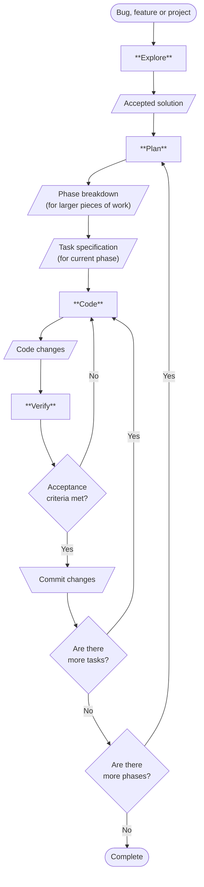

# Open Code agent for Explore → Plan → Code → Verify workflow

A disciplined, iterative workflow system for AI-assisted software development that ensures quality while maintaining developer control.

## Overview

The EPCV (Explore → Plan → Code → Verify) system enforces a structured approach to coding tasks:

1. **Explore** - Understand the codebase before making changes
2. **Plan** - Design solutions and break work into atomic tasks
3. **Code** - Implement each task precisely
4. **Verify** - Validate through four-layered checks



## Key Features

- **Human-in-the-loop**: Two mandatory approval gates ensure developer control
- **Iterative workflow**: Task loops and phase loops handle projects of any size
- **Atomic tasks**: Small, independently verifiable units of work
- **Four-layer verification**: Automated, behavioural, operational, and security checks
- **Bug-fixing loop escape**: Prevents wasted effort on repeated patch attempts

## Inspiration

This system was inspired by [OpenAgentsControl](https://github.com/darrenhinde/OpenAgentsControl) and builds upon its principles of structured AI-assisted development.

## Documentation

- [AGENTS.md](AGENTS.md) - Comprehensive guidelines for agentic coding agents
- [ARCHITECTURE.md](.opencode/ARCHITECTURE.md) - System design and component relationships
- [QUICK-START.md](.opencode/QUICK-START.md) - Get started in 5 minutes
- [TESTING.md](.opencode/TESTING.md) - Validation checklist and testing approach

## Development

### Markdown Linting

This project uses [markdownlint-cli2](https://github.com/DavidAnson/markdownlint-cli2) for markdown linting:

```bash
# Install
npm install -g markdownlint-cli2

# Run linting
markdownlint-cli2 "**/*.md"

# Fix issues
markdownlint-cli2 "**/*.md" --fix
```

## License

[MIT License](LICENSE)
